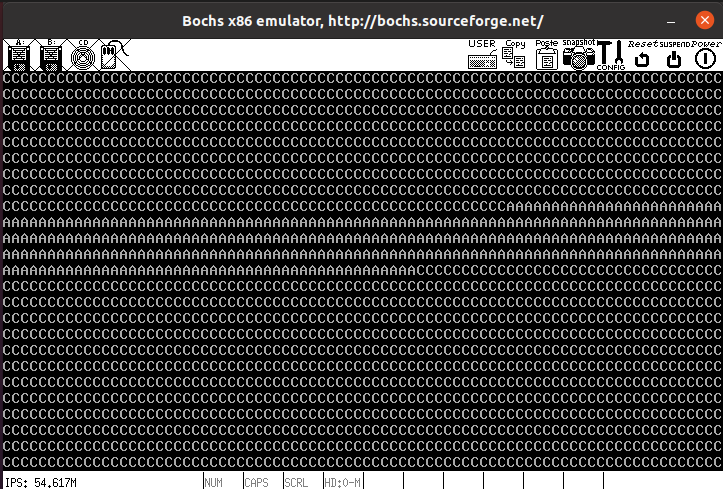
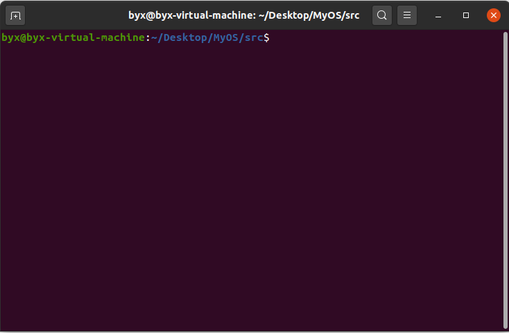
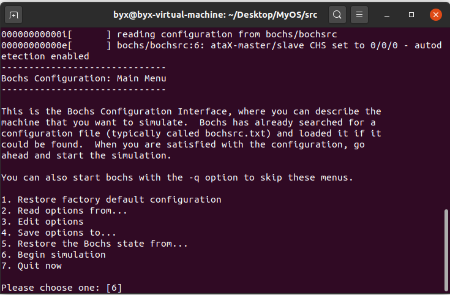
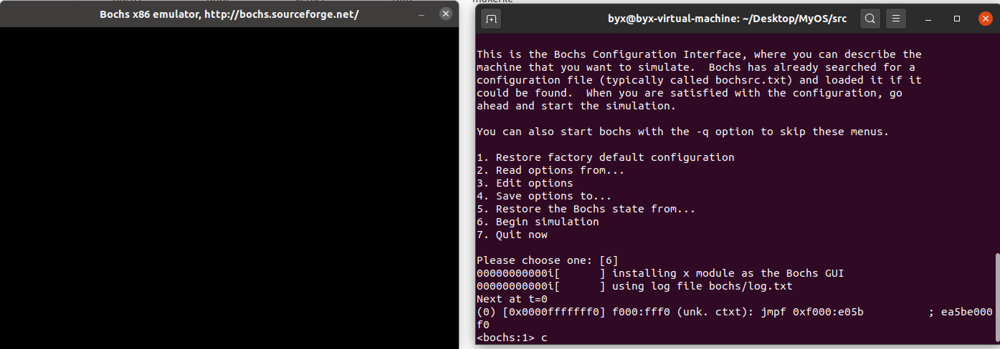
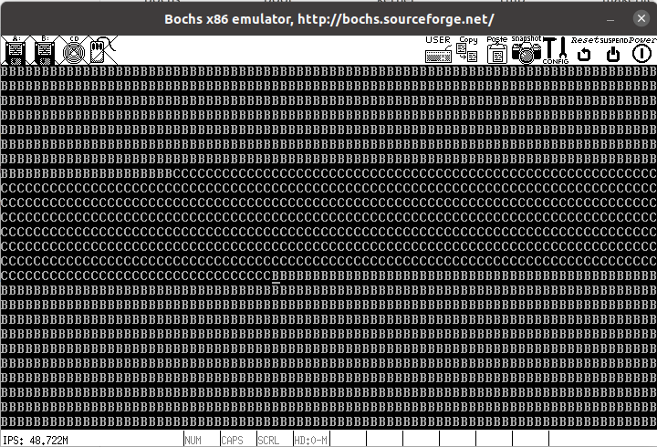

# MyOS

自制操作系统

基于《操作系统真象还原》实现

图片说明：一个交替输出A、B、C的程序

## 环境搭建

要运行此操作系统，需要安装如下软件包：

* gcc-multilib
* bochs

## 运行步骤

1. 进入`MyOS/src`目录（`makefile`文件所在目录）

   

2. 执行`make`命令

   

3. 在弹出的bochs选项中选择`[6]`，按回车

   

4. 在弹出的bochs命令行中输入`c`，按回车，即可开始运行

   